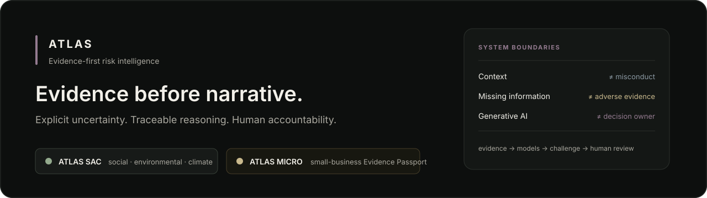
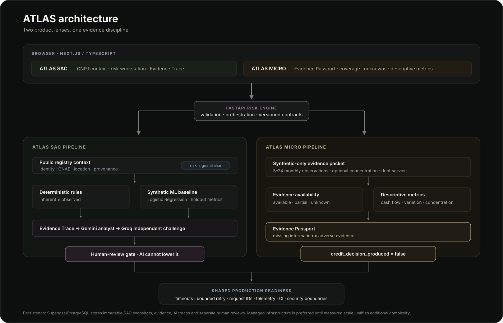

<p align="center">
  
</p>

# ATLAS

**Evidence-first risk intelligence with explicit uncertainty and human oversight.**

[](https://github.com/ApoloLightX/ProjetoNu/actions/workflows/ci.yml)

**Live ATLAS SAC:** https://atlas-sac-ui.vercel.app  
**Live ATLAS Micro:** https://atlas-sac-ui.vercel.app/micro  
**Risk engine:** https://atlas-sac-api.vercel.app

ATLAS is an independent engineering research project exploring a deceptively difficult question:

> **How do you use data, deterministic rules, statistical models and generative AI without losing the meaning of evidence, uncertainty or human accountability?**

The project now answers that question through two related product lenses.

| Module | Question | Current boundary |
|---|---|---|
| **ATLAS SAC** | What social, environmental and climate risk can the available evidence support? | Real registry context + clearly synthetic SAC simulation |
| **ATLAS Micro** | What can the available evidence actually prove about a small business before anyone judges it? | Synthetic-only Evidence Passport, no credit decision |

## 30-second overview

### ATLAS SAC

A CNPJ can load identity, CNAE, location and provenance. That public registry context is explicitly **not** adverse evidence. The risk engine keeps inherent exposure separate from company-specific observed signals, exposes evidence gaps, runs a synthetic statistical baseline, lets one LLM analyze and another challenge, and escalates ambiguity/materiality through a human-review gate.

### ATLAS Micro

A small business can have a thin formal evidence trail without that absence itself being negative. ATLAS Micro therefore solves the **evidence-readiness problem before the prediction problem**. Its Evidence Passport separates available, partial and unknown information from descriptive operational metrics.

The API contract is intentionally explicit:

```text
credit_decision_produced = false
```

The common principle is:

> **Evidence before narrative. Missing information is uncertainty, not an invented fact.**

## Why this is difficult

Weak risk interfaces often collapse concepts that should remain different:

```text
context             ≠ misconduct
missing information ≠ adverse evidence
model probability   ≠ truth
LLM narrative       ≠ decision authority
100% data coverage  ≠ 100% safety
```

ATLAS makes those separations part of the data contracts, tests and interface rather than leaving them as disclaimers after the model runs.

<p align="center">
  
</p>

## Product flow

### SAC

```text
CNPJ / company context
        ↓
public registry + provenance
        ↓
risk_signal = false
        ↓
deterministic SAC methodology
        ↓
inherent exposure ≠ observed evidence
        ↓
synthetic Logistic Regression baseline
        ↓
Evidence Trace
        ↓
Gemini structured analyst
        ↓
Groq independent reviewer
        ↓
human-review gate
        ↓
optional immutable persistence / replay
```

### Micro

```text
synthetic small-business evidence packet
        ↓
schema validation
        ↓
descriptive operational metrics
        +
evidence coverage
        ↓
explicit data gaps
        ↓
Evidence Passport
        ↓
ready for review / needs evidence / short history
        ↓
NO credit approval, denial, price or limit
```

## Architecture

<p align="center">
  
</p>

The current system is intentionally managed/serverless rather than distributed for its own sake:

- **Web:** Next.js + React + TypeScript
- **API:** Python + FastAPI + Pydantic + HTTPX
- **Data:** PostgreSQL / Supabase
- **ML:** scikit-learn, Logistic Regression, reproducible synthetic dataset
- **AI:** Gemini analyst + Groq independent reviewer, structured outputs
- **Testing:** pytest + Vitest + TypeScript checks
- **Delivery:** GitHub Actions + Vercel previews/production

See [`docs/ARCHITECTURE.md`](docs/ARCHITECTURE.md) for system boundaries and [`docs/decisions.md`](docs/decisions.md) for the trade-offs behind them.

## Evidence model

ATLAS distinguishes **information state** from **risk severity**.

### Context

Information that identifies or explains exposure, such as public registry identity, sector or geography. Context does not prove misconduct.

### Observed

Company-specific evidence or signals that may support a risk conclusion when provenance and scope are clear.

### Unknown

Expected information that is missing, stale, unavailable or unverified. Unknown information affects confidence/readiness and can trigger additional review. It does not become a favorable or adverse fact by default.

The SAC Evidence Trace lets a reviewer move backward from a conclusion to its drivers, evidence class, provenance and methodological boundaries without asking an LLM to reconstruct history after the fact.

See [`docs/evidence-trace.md`](docs/evidence-trace.md).

## ATLAS SAC

The deterministic layer produces five experimental SAC dimensions:

- social;
- environmental;
- climate physical;
- climate transition;
- reputational/context.

It also keeps **inherent risk** separate from **observed risk**.

`evidence_completeness` affects confidence and human review, not the synthetic ML risk feature set. This prevents missing evidence from becoming an accidental mechanism for making a counterparty look safer or riskier.

### Public registry boundary

```text
GET /v1/registry/cnpj/{cnpj}
```

The public registry connector normalizes identity, status, CNAE, municipality/state, company size, legal nature and source URL.

Its response preserves:

```text
source_is_official = false
risk_signal = false
```

A real CNPJ therefore does **not** turn the synthetic SAC demonstration into a real finding about that company.

See [`docs/public-data.md`](docs/public-data.md).

### Statistical baseline

```text
GET  /v1/ml/evaluation
POST /v1/ml/predict
```

The first model is Logistic Regression trained on a reproducible **synthetic dataset**. It exists as an interpretable baseline for model-lifecycle engineering, not as a claim of real-world predictive performance.

Holdout reporting includes ROC-AUC, precision, recall and Brier score instead of promoting one flattering metric in isolation.

See [`docs/ml-baseline.md`](docs/ml-baseline.md).

## ATLAS Micro · Evidence Passport

```text
POST /v1/micro/readiness
```

V8 accepts only synthetic evidence packets containing 3–24 monthly cash-flow observations plus optional customer-concentration and debt-service context.

It returns:

- periods observed;
- average inflows/outflows and net cash flow;
- non-negative month ratio;
- inflow variation;
- customer concentration when supplied;
- debt-service burden when supplied;
- evidence coverage;
- explicit data gaps;
- one evidence-readiness state.

The three states are:

```text
INSUFFICIENT_HISTORY
NEEDS_MORE_EVIDENCE
EVIDENCE_READY_FOR_REVIEW
```

None means approved, denied, good borrower or bad borrower.

The `/micro` interface lets a reviewer switch between a complete packet, missing evidence and short history. When information disappears, the fields become **unknown** and readiness changes. The system does not create a negative risk signal from the silence.

See [`docs/atlas-micro.md`](docs/atlas-micro.md).

## AI Safety & Model Governance

The AI layer is deliberately subordinate to evidence and deterministic authority.

- Gemini receives a bounded structured packet.
- Material findings must cite allowed evidence/deterministic/ML references.
- Groq independently challenges unsupported claims, causal overreach, missing-evidence assumptions and inherent-vs-observed confusion.
- Unknown evidence references invalidate the governed AI path.
- LLM output cannot rewrite deterministic scores.
- LLM output cannot remove an already-required human review.
- Provider failure degrades to the safer deterministic path instead of fabricating a substitute conclusion.
- Provider/model/role/prompt version/input hash/latency can be traced when the AI path runs.

Two models are **not** assumed to eliminate hallucination. They may share the same mistake, which is why independent review is treated as one control inside a broader governance system rather than proof of correctness.

Read the full threat/model discussion in [`docs/ai-safety-model-governance.md`](docs/ai-safety-model-governance.md).

## Human review

Human review is not a decorative `Approve` button.

It exists for cases where automation should stop and expose the problem:

- material/high deterministic risk;
- company-specific observed signals;
- insufficient evidence;
- model disagreement;
- ambiguous attribution or provenance;
- future reviewer judgment that requires context beyond the automated result.

The persisted human review is stored separately from the original automated assessment so disagreement does not rewrite history.

## Persistence & replay

Versioned Supabase/PostgreSQL migrations support:

```text
POST /v1/assessments                  deterministic assessment
POST /v1/assessments/persist          immutable assessment snapshot
GET  /v1/assessments/{run_id}         replay stored result
POST /v1/assessments/{run_id}/reviews separate human review
POST /v1/ai/assess                     assistive AI review
```

Historical assessment snapshots retain input/result/methodology information instead of being silently recomputed under future rules.

See [`docs/database-recovery.md`](docs/database-recovery.md).

## Production-readiness posture

ATLAS uses production-readiness controls that solve current failure modes:

- explicit dependency timeouts;
- bounded retry with exponential backoff + jitter for retry-safe registry GETs;
- request correlation with `X-Request-ID`;
- structured request/dependency telemetry without secrets or raw prompts;
- conservative security headers;
- bounded evidence payloads;
- CI typecheck/lint/test/build gates;
- RLS/grant/index inspection;
- documented recovery posture;
- dependency monitoring.

### Known open gaps

- Shared/platform rate limiting for expensive public endpoints still needs to be configured and verified.
- Provider backup retention/RPO/RTO should not be claimed until the active capability is verified.
- Real financial-data consent/reviewer identity/audit flows do not exist yet.
- The ML dataset is synthetic and cannot establish production predictive performance.

### What ATLAS deliberately does not use yet

```text
Kubernetes
sharding
service discovery
Saga / distributed transactions
distributed locks
active-active multi-region
chaos engineering
```

Those are not badges of maturity. They are tools with operating costs and new failure modes. ATLAS documents a **revisit trigger** for architecture choices instead of implementing hypothetical scale.

See [`docs/production-readiness.md`](docs/production-readiness.md) and [`docs/decisions.md`](docs/decisions.md).

## Engineering decisions worth discussing

Some of the most important choices are things the project **refuses** to do:

1. Deterministic authority before generative interpretation.
2. Inherent exposure stays separate from observed evidence.
3. Missing evidence changes confidence/readiness, not risk by default.
4. Logistic Regression before complex ML on synthetic data.
5. An AI analyst plus an independent reviewer, without pretending two models guarantee truth.
6. CNPJ registry data remains context with `risk_signal=false`.
7. ATLAS Micro solves evidence readiness before attempting credit prediction.
8. Real Open Finance ingestion waits for a legitimate consent/partner architecture.
9. Managed/serverless infrastructure comes before Kubernetes.
10. Authentication/passkeys wait until real reviewer accounts exist.
11. AI failure degrades capability instead of truthfulness.
12. Human review is separate from immutable automated history.

The full decision log is in [`docs/decisions.md`](docs/decisions.md).

## Testing & CI

Every feature branch is expected to pass:

```text
Python
  Ruff
  pytest

Web
  TypeScript typecheck
  Vitest
  Next.js production build
```

Behavioral tests protect product semantics, not just syntax. Examples include:

- missing ATLAS Micro evidence stays `unknown`, never adverse;
- non-synthetic financial input is rejected in the V8 foundation;
- duplicate monthly periods are rejected;
- public registry context does not become observed adverse evidence;
- retry boundaries remain bounded;
- request IDs propagate safely;
- evidence payload size is bounded;
- governed AI output cannot rely on unknown evidence references.

## Demo & explanation

A real-screen capture storyboard is documented in [`docs/demo-script.md`](docs/demo-script.md).

The intended README media sequence is:

```text
20-second GIF
SAC → Evidence Trace → AI/human boundary → Micro → missing evidence → no credit decision

60–90 second demo
problem → architecture → traceability → governed AI → Evidence Passport → limitations
```

The repository does **not** include AI-generated fake product screenshots as proof of functionality. The final GIF/video should be captured from the real deployed interface.

For an interview-oriented explanation of the project, including 30-second/2-minute pitches and likely technical questions, see [`docs/interview-guide.md`](docs/interview-guide.md).

## Repository map

```text
ProjetoNu/
├── apps/web/                       # Next.js ATLAS SAC + ATLAS Micro UI
├── services/risk-engine/           # FastAPI rules + ML + AI + Micro readiness
├── supabase/migrations/            # versioned database/security migrations
├── assets/
│   ├── atlas-hero.svg
│   ├── architecture.svg
│   └── evidence-flow.svg
├── docs/
│   ├── ARCHITECTURE.md
│   ├── ai-review.md
│   ├── ai-safety-model-governance.md
│   ├── atlas-micro.md
│   ├── database-recovery.md
│   ├── decisions.md
│   ├── demo-script.md
│   ├── evidence-trace.md
│   ├── interview-guide.md
│   ├── ml-baseline.md
│   ├── production-readiness.md
│   └── public-data.md
└── .github/workflows/ci.yml
```

## Run locally

### Risk engine

```bash
cd services/risk-engine
python -m venv .venv
source .venv/bin/activate  # Windows: .venv\Scripts\activate
pip install -e ".[dev]"
uvicorn app.main:app --reload --port 8000
```

API docs: `http://localhost:8000/docs`

### Web

```bash
cd apps/web
npm install
npm run dev
```

Open:

```text
http://localhost:3000        ATLAS SAC
http://localhost:3000/micro  ATLAS Micro
```

The web app defaults to `http://localhost:8000`. To point it elsewhere:

```bash
NEXT_PUBLIC_RISK_API_URL=https://your-risk-engine.example
```

For browser access across origins:

```bash
RISK_ENGINE_ALLOWED_ORIGINS=https://your-frontend.example
```

Provider/persistence secrets belong only in the backend environment and are never committed.

## Evolution

```text
V0  foundation + deterministic SAC
V1  functional workstation
V2  synthetic ML + governed dual-model AI
V3  public CNPJ context
V4  institutional evidence-first UI
V5  CNPJ-first workflow
V6  Evidence Trace
V7  production hardening
V8  ATLAS Micro evidence-readiness foundation
V8.1 Evidence Passport
```

The next meaningful product work is intentionally **not** “add more AI”. It is better provenance, source quality, real evidence integrations where lawful, stronger evals and the operational controls justified by actual usage.

## Limitations

ATLAS is intentionally explicit about what it cannot currently prove:

- SAC signals in the public risk simulation are synthetic.
- A real CNPJ lookup does not create a real SAC assessment of that company.
- The Logistic Regression dataset is synthetic.
- Gemini/Groq review does not guarantee correctness or eliminate hallucination.
- ATLAS Micro uses fictitious business identity and synthetic financial observations.
- ATLAS Micro is not a credit-scoring or underwriting system.
- No real Open Finance integration exists.
- No claim of regulatory compliance/certification is made.
- The system is not designed for unattended adverse/high-impact decisions.
- Production scale, SLOs and failure budgets have not been validated under meaningful public traffic.

These limits are part of the engineering story rather than items to hide.

## References & independence

ATLAS is informed by public technical, regulatory and governance materials. Public references define the **problem class and terminology**, not an institution's internal implementation.

ATLAS is **not affiliated with Nubank or any financial institution** and does not claim to reproduce their internal models, architecture or decision processes.

## Disclaimer

ATLAS is an educational, portfolio and engineering research project. It is not financial, legal or regulatory advice and must not be used to make real credit, onboarding or counterparty decisions without appropriate governance, validation, data rights and qualified human review.
