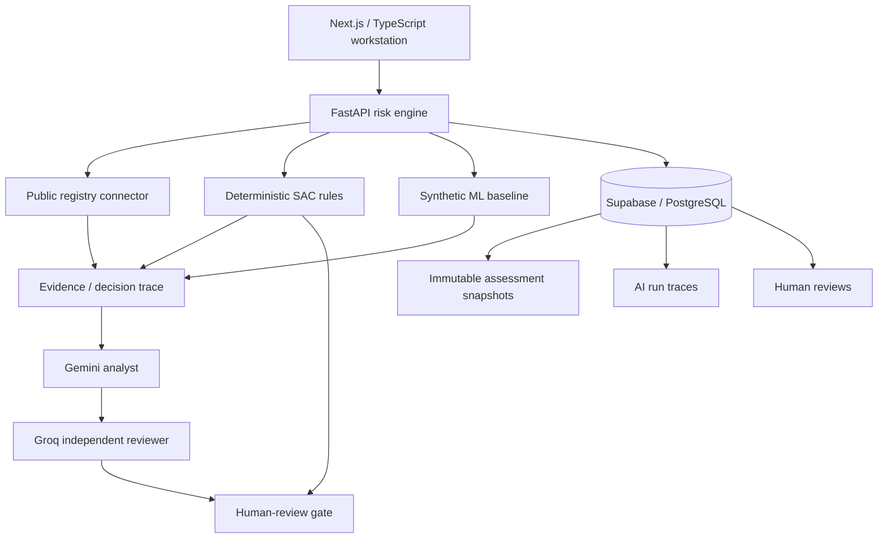

# ATLAS SAC

**Evidence-first Social, Environmental & Climate Risk Intelligence**

[](https://github.com/ApoloLightX/ProjetoNu/actions/workflows/ci.yml)

**Live product:** https://atlas-sac-ui.vercel.app  
**Risk engine:** https://atlas-sac-api.vercel.app  

ATLAS SAC is an independent experimental platform for identifying, classifying, explaining and monitoring **social, environmental and climate (SAC) risk** in corporate counterparties.

The project explores one engineering question:

> How can public data, deterministic rules, statistical models and LLM-assisted review support a traceable SAC risk assessment without turning probabilistic models into unquestioned decision-makers?

## Product thesis

ATLAS is built around five boundaries:

1. **Evidence before narrative.** Material conclusions must be traceable back to supplied data or explicit model inputs.
2. **Inherent exposure is not observed misconduct.** Sector/geographic context stays separate from company-specific adverse evidence.
3. **Uncertainty is visible.** Missing evidence reduces confidence and can increase the need for human review; it must not make a counterparty look safer.
4. **AI assists, it does not own the decision.** LLMs explain and challenge; they do not rewrite deterministic scores.
5. **Human review is a governance gate.** High risk, weak evidence, disagreement or material ambiguity can prevent automatic closure.

## What works today

The current public product includes:

- a Next.js + TypeScript institutional risk workstation;
- CNPJ-first company lookup through a public registry connector;
- explicit provenance for registry context;
- a hard `risk_signal=false` boundary for CNPJ registry data;
- deterministic SAC risk scoring across five dimensions;
- separate inherent and observed risk layers;
- evidence completeness, uncertainty and human-review gates;
- a first-class evidence trace explorer;
- an interpretable synthetic Logistic Regression baseline;
- holdout ROC-AUC, precision, recall and Brier-score reporting;
- Gemini structured analyst + Groq independent reviewer;
- evidence-reference allowlisting and prompt-injection boundaries;
- safe degradation when AI providers fail or return unsupported output;
- immutable assessment snapshots and replay through Supabase/PostgreSQL;
- separate human-review and AI-trace persistence;
- RLS-enabled persistence with server-only privileged writes;
- bounded retry/backoff for retry-safe public-data GET requests;
- request correlation through `X-Request-ID`;
- structured request/dependency telemetry without raw prompts or secrets;
- conservative frontend/API security headers;
- GitHub Actions quality gates for Python and web builds.

### Important public-demo boundary

A real CNPJ can load **identity, CNAE, municipality/state and provenance**.

That does **not** make the SAC result a real finding about that company. The public demo still uses clearly labeled synthetic SAC signals for the experimental risk calculation. Registry context is never silently converted into adverse observed evidence.

## Current user flow

```text
CNPJ / company
      ↓
public registry context
      ↓
identity + CNAE + location + provenance
      ↓
explicit experimental SAC simulation
      ↓
deterministic risk + synthetic ML signal
      ↓
evidence trace
      ↓
Gemini analyst
      ↓
Groq independent reviewer
      ↓
human-review gate when required
```

## Architecture



## Why the AI layer cannot decide

The LLM path is intentionally subordinate to the deterministic methodology.

- Gemini receives only the supplied counterparty inputs, deterministic result, synthetic ML result and enumerated evidence.
- Every material analyst finding must cite an allowed reference such as `DET:environmental_risk`, `ML:synthetic_baseline` or `E1`.
- Groq independently challenges unsupported claims, inherent-vs-observed confusion, missing-evidence assumptions and misuse of the synthetic ML signal.
- Unknown evidence references invalidate the AI path.
- Model disagreement can increase review requirements.
- LLM output cannot lower a deterministic human-review requirement.
- Provider failure degrades to the safer deterministic path.

See [`docs/ai-review.md`](docs/ai-review.md).

## Evidence model

ATLAS distinguishes the state of information from its severity.

```text
CONTEXT
information that helps identify/explain exposure

OBSERVED
counterparty-specific signal/evidence

UNKNOWN
expected information that is missing or not validated
```

The Evidence Trace V1 lets a reviewer move backward from a conclusion to its drivers, evidence class, provenance and methodological boundaries without asking an LLM to reconstruct the history after the fact.

See [`docs/evidence-trace.md`](docs/evidence-trace.md).

## Risk methodology

The deterministic layer produces five SAC dimensions:

- social;
- environmental;
- climate physical;
- climate transition;
- reputational/context.

It also keeps **inherent risk** separate from **observed risk**.

`evidence_completeness` affects confidence and human review, not the synthetic ML risk feature set. This is deliberate: missing evidence must not become a mechanism for making a counterparty look safer.

## Statistical baseline

```text
GET  /v1/ml/evaluation
POST /v1/ml/predict
```

The first model is Logistic Regression trained on a reproducible **synthetic dataset**. It exists as an interpretable statistical baseline, not as a claim of production credit performance.

The API reports multiple holdout metrics rather than presenting one flattering number in isolation.

See [`docs/ml-baseline.md`](docs/ml-baseline.md).

## Public data and provenance

```text
GET /v1/registry/cnpj/{cnpj}
```

The first connector uses BrasilAPI / Minha Receita as a registry enrichment source.

Normalized context includes fields such as:

- legal / trade name;
- registration status;
- primary CNAE;
- municipality and state;
- company size;
- legal nature;
- exact source URL.

The response explicitly preserves:

```text
source_is_official = false
risk_signal = false
```

That is a product boundary, not metadata decoration.

See [`docs/public-data.md`](docs/public-data.md).

## Persistence and replay

The dedicated Supabase project has the versioned migrations applied. Privileged persistence remains backend-only.

```text
POST /v1/assessments                  deterministic assessment
POST /v1/assessments/persist          immutable assessment snapshot
GET  /v1/assessments/{run_id}         replay stored result
POST /v1/assessments/{run_id}/reviews separate human review
POST /v1/ai/assess                     assistive AI review
```

Past results store input/result snapshots plus methodology version so historical decisions can be inspected without silently recomputing them using future rules.

The persistence boundary has been checked against the connected database for RLS, grants and known query-path indexes. ATLAS deliberately does not invent a backup guarantee until the active provider backup/retention capability is verified.

See [`docs/database-recovery.md`](docs/database-recovery.md).

## Production-readiness posture

ATLAS does not treat infrastructure keywords as badges.

V7 focuses on controls that the current architecture actually needs:

- explicit dependency timeouts;
- bounded retries with exponential backoff + jitter for retry-safe CNPJ GETs;
- request correlation IDs;
- structured request/dependency telemetry;
- security headers;
- CI + preview deployment + rollback path;
- database security/index/recovery review.

Platform/shared rate limiting remains a **NOW** concern for expensive public routes. ATLAS does not pretend that an in-memory counter inside a serverless FastAPI process would provide a globally correct limiter.

Kubernetes, sharding, service discovery, distributed locks, Saga frameworks, active-active multi-region and chaos engineering are intentionally deferred until a measured workload or reliability requirement justifies them.

See [`docs/production-readiness.md`](docs/production-readiness.md).

## Stack

- **Frontend:** Next.js, React, TypeScript
- **Risk engine:** Python, FastAPI, Pydantic, HTTPX
- **Data:** PostgreSQL / Supabase
- **ML:** scikit-learn, Logistic Regression, versioned synthetic data
- **AI:** Gemini + Groq, structured outputs, independent reviewer pattern
- **Testing:** pytest + Vitest
- **CI/CD:** GitHub Actions + Vercel previews/production

## Repository map

```text
ProjetoNu/
├── apps/web/                  # public Next.js workstation
├── services/risk-engine/      # FastAPI + rules + ML + AI + persistence
├── supabase/migrations/       # versioned database/security migrations
├── docs/
│   ├── ARCHITECTURE.md
│   ├── ai-review.md
│   ├── database-recovery.md
│   ├── deployment.md
│   ├── evidence-trace.md
│   ├── ml-baseline.md
│   ├── production-readiness.md
│   └── public-data.md
└── .github/workflows/ci.yml
```

## Run locally

### Risk engine

```bash
cd services/risk-engine
python -m venv .venv
source .venv/bin/activate  # Windows: .venv\Scripts\activate
pip install -e ".[dev]"
uvicorn app.main:app --reload --port 8000
```

API docs: `http://localhost:8000/docs`

### Web app

```bash
cd apps/web
npm install
npm run dev
```

Open `http://localhost:3000`.

The frontend defaults to `http://localhost:8000`. To point it elsewhere:

```bash
NEXT_PUBLIC_RISK_API_URL=https://your-risk-engine.example
```

For cross-origin browser access, configure the backend allowlist:

```bash
RISK_ENGINE_ALLOWED_ORIGINS=https://your-frontend.example
```

Server-side provider/persistence credentials are configured only in the backend environment and are never committed to the repository.

## Testing and CI

The pull-request pipeline runs:

```text
Python
  Ruff
  pytest

Web
  TypeScript typecheck
  Vitest
  Next.js production build
```

Production-hardening tests additionally cover retry boundaries, request-ID propagation and structured telemetry behavior.

## Roadmap

### V0 · Foundation
- [x] project thesis and safety boundaries
- [x] repository / FastAPI foundation
- [x] deterministic SAC engine
- [x] Supabase schema
- [x] automated Python quality gate

### V1 · Functional demo
- [x] synthetic counterparty lab
- [x] SAC dashboard
- [x] inherent vs observed risk
- [x] evidence completeness and uncertainty
- [x] human-review state
- [x] Next.js → FastAPI integration

### V2 · ML + governed AI
- [x] reproducible synthetic ML baseline
- [x] holdout evaluation
- [x] Gemini structured analyst
- [x] Groq independent reviewer
- [x] evidence-reference grounding
- [x] prompt-injection boundary
- [x] safe AI degradation

### V3 · Public company context
- [x] public CNPJ enrichment
- [x] normalized company profile
- [x] provenance boundary
- [x] `risk_signal=false`

### V4 · Institutional workstation
- [x] evidence-first visual hierarchy
- [x] risk / uncertainty / human-review focus
- [x] methodology subordinate to the decision surface
- [x] responsive web experience

### V5 · CNPJ-first workflow
- [x] real CNPJ as company-context entry point
- [x] explicit separation between real registry data and synthetic SAC simulation
- [x] provenance-aware evidence table

### V6 · Evidence trace
- [x] consolidated SAC trace
- [x] environmental trace
- [x] inherent vs observed trace
- [x] uncertainty / missing-evidence trace
- [x] trace-boundary tests

### V7 · Production hardening
- [x] outbound timeouts
- [x] bounded retry/backoff for public registry
- [x] request correlation
- [x] request/dependency telemetry
- [x] conservative security headers
- [x] database RLS/grant/index review
- [x] reproducible recovery runbook
- [ ] platform/shared rate limiting for expensive public endpoints
- [ ] verify provider backup retention before claiming runtime-data RPO/RTO

### Later, only when justified by product evidence
- [ ] authenticated reviewer accounts + passkeys/WebAuthn
- [ ] persisted evidence graph with stable node/edge IDs
- [ ] real SAC evidence connectors with source-specific provenance
- [ ] risk timeline / reassessment triggers
- [ ] reviewer audit workflow
- [ ] SLI/SLO/error-budget program after meaningful traffic exists

## Public-policy inspiration

The project is informed by public materials, not private/internal bank information:

- Banco Central do Brasil — Resolução CMN 4.943/2021
- Banco Central do Brasil — DRSAC
- Nubank public governance / PRSAC materials

These references define the **problem class and terminology**. ATLAS does not claim regulatory compliance, legal adequacy, or equivalence to any institution's production system.

## Disclaimer

ATLAS SAC is an educational, portfolio and engineering research project. It is **not affiliated with Nubank**, is not financial or legal advice, and must not be used to make real credit, onboarding or counterparty decisions without appropriate governance, validation, data rights and qualified human review.
